---
## Front matter
title: "Отчет по лабораторной работе №5"
subtitle: "Архитектура вычислительных систем"
author: "Пашаев Юсиф"

## Generic otions
lang: ru-RU
toc-title: "Содержание"

## Bibliography
bibliography: bib/cite.bib
csl: pandoc/csl/gost-r-7-0-5-2008-numeric.csl

## Pdf output format
toc: true # Table of contents
toc-depth: 2
lof: true # List of figures

fontsize: 12pt
linestretch: 1.5
papersize: a4
documentclass: scrreprt
## I18n polyglossia
polyglossia-lang:
  name: russian
  options:
	- spelling=modern
	- babelshorthands=true
polyglossia-otherlangs:
  name: english
## I18n babel
babel-lang: russian
babel-otherlangs: english
## Fonts
mainfont: PT Serif
romanfont: PT Serif
sansfont: PT Sans
monofont: PT Mono
mainfontoptions: Ligatures=TeX
romanfontoptions: Ligatures=TeX
sansfontoptions: Ligatures=TeX,Scale=MatchLowercase
monofontoptions: Scale=MatchLowercase,Scale=0.9
## Biblatex
biblatex: true
biblio-style: "gost-numeric"
biblatexoptions:
  - parentracker=true
  - backend=biber
  - hyperref=auto
  - language=auto
  - autolang=other*
  - citestyle=gost-numeric
## Pandoc-crossref LaTeX customization
figureTitle: "Рис."
tableTitle: "Таблица"
listingTitle: "Листинг"
lofTitle: "Список иллюстраций"
lolTitle: "Листинги"
## Misc options
indent: true
header-includes:
  - \usepackage{indentfirst}
  - \usepackage{float} # keep figures where there are in the text
  - \floatplacement{figure}{H} # keep figures where there are in the text
---

# Цель работы

Приобретение практических навыков работы в Midnight Commander. Освоение
инструкций языка ассемблера mov и int.
# Задание

1. Создайте копию файла lab6-1.asm. Внесите изменения в программу (без
использования внешнего файла in_out.asm), так чтобы она работала по
следующему алгоритму:
• вывести приглашение типа “Введите строку:”;
• ввести строку с клавиатуры;
• вывести введённую строку на экран.
2. Получите исполняемый файл и проверьте его работу. На приглашение
ввести строку введите свою фамилию.
3. Создайте копию файла lab6-2.asm. Исправьте текст программы с исполь-
зование подпрограмм из внешнего файла in_out.asm, так чтобы она ра-
ботала по следующему алгоритму:
• вывести приглашение типа “Введите строку:”;
• ввести строку с клавиатуры;
• вывести введённую строку на экран.

# Выполнение лабораторной работы

1)Откроем Midnight Commander. Пользуясь клавишами перейдем в каталог ~/work/arch-
pc. С помощь клавиши F7 создаем папку lab05 и перейдем в созданный каталог.

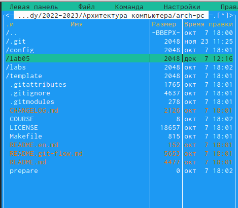{ #fig:001 width=90% }

2)Пользуясь строкой ввода и командой touch создаем файл lab5.asm
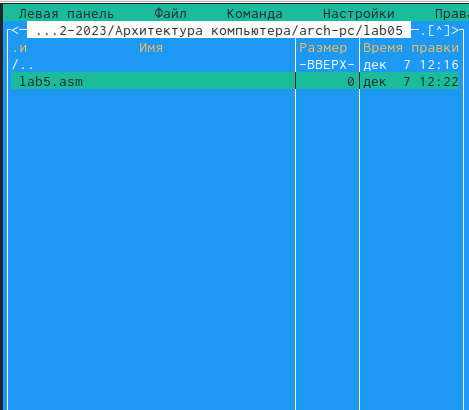{ #fig:002 width=90% }

3)Введем текст программы из листинга 6.1. Сохраним изменения и выйдем. Зайдем обратно и убедимся, что файл содержит текст программы.

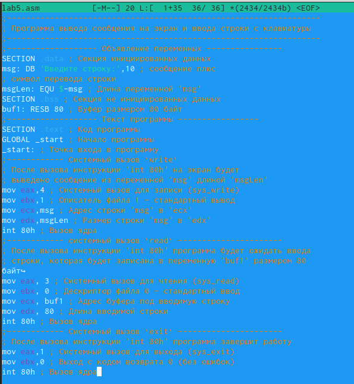{ #fig:003 width=90% }

4) Оттранслируем тект программы /lab5.asm в объективный файл. Выполним компоновку объектного файла и запустим получившийся исполняемый файл.

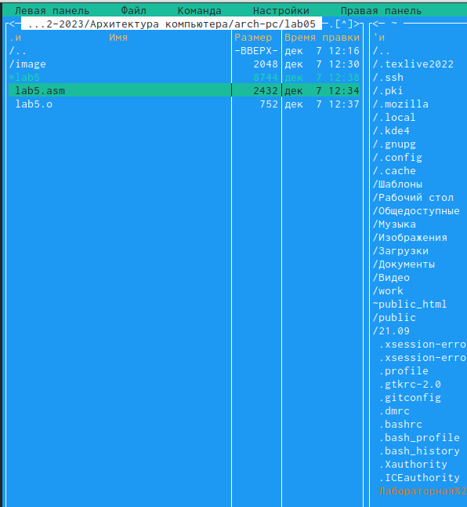{ #fig:004 width=90% }

5) Загрузим файл in_out.asm с туиса. В одной из панелей mc откроем каталог с файлом lab5-1.asm. Скопируем файл in_out.asm в каталог с файлом lab5-1.asm. С помощью клавиши f5 создаем копию файла lab5-1.asm с именем lab5-2.asm

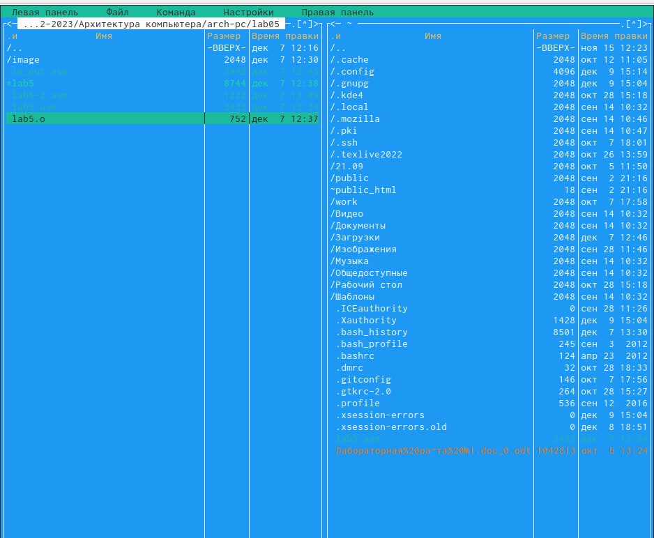{ #fig:005 width=90% }

6) Исправим текст программы в файле lab6-2.asm с использование под-
программ из внешнего файла in_out.asm.

{ #fig:006 width=90% }

7) В lab5-2.asm заменил подпрограмму sprintFL на sprint, создал файл и выявил разницу - она заключается в выводе текста.

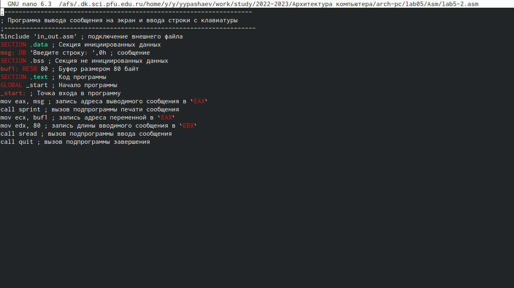{ #fig:007 width=90% }

# Выполнение самостоятельной работы

1) Создаем копию файла lab5.asm. Внесем изменения в программу. Получил исполняемый файл и проверил его на работу. На приглашение ввести строку ввел свою фамилию.

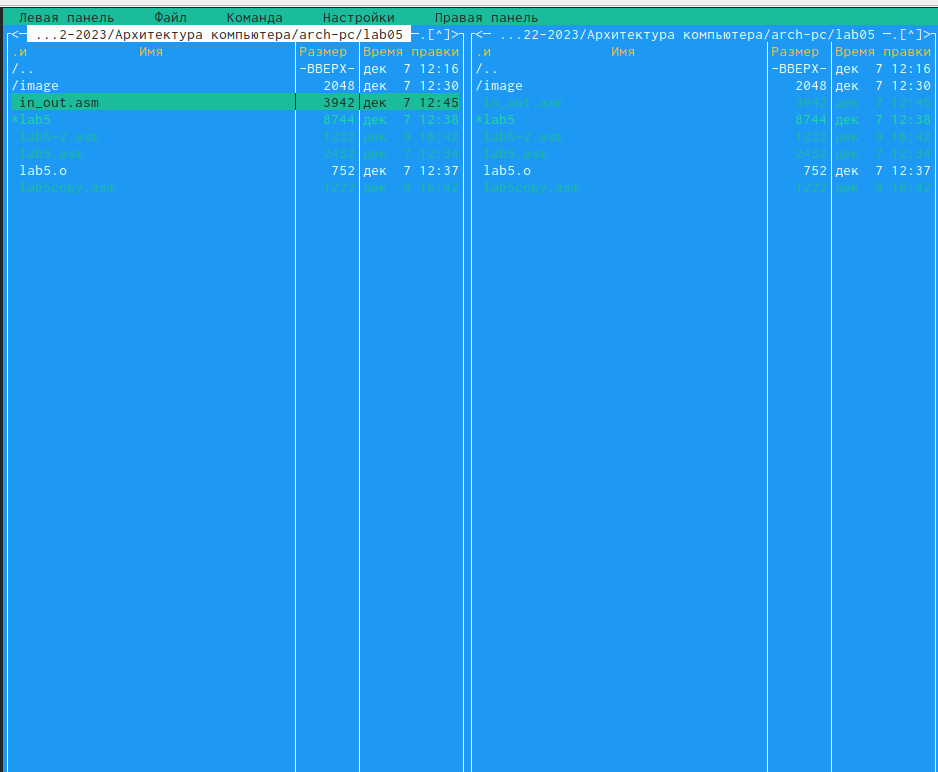{ #fig:008 width=90% }

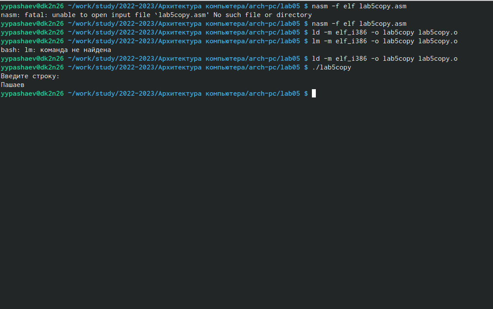{ #fig:009 width=90% }

2) Создаем копию файла lab5-2.asm Исправил текст программы с использованием подпрограмм из внешнего файла in_out.asm

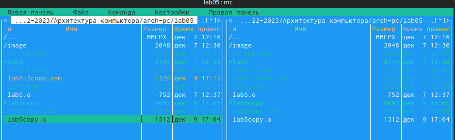{ #fig:010 width=90% }

3) Создаем исполняемый файл и проверил работу.

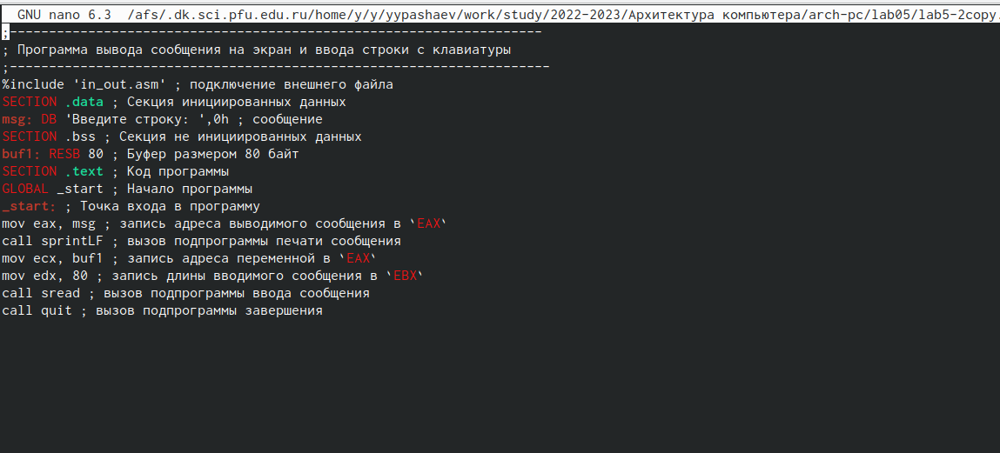{ #fig:012 width=90% }

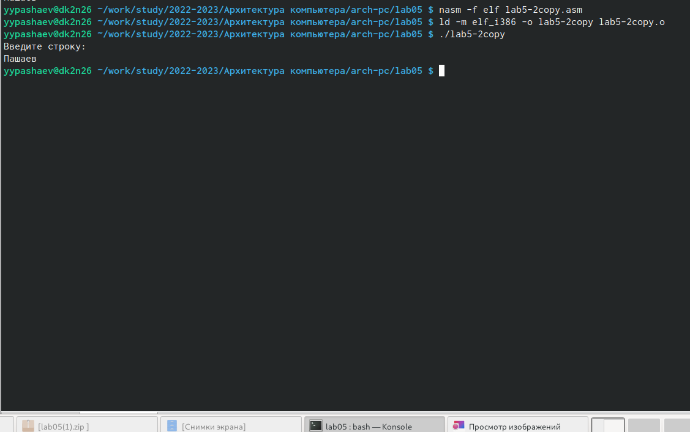{ #fig:013 width=90% }

# Выводы
В ходе выполнения лабораторной работы №5 я приобрел практические навыков работы в Midnight Commander. И освоил инструкции языка ассемблера mov и int.

