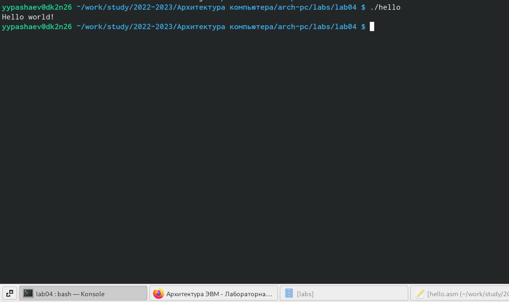

---
## Front matter
title: "Отчет по лабораторной работе №4"
subtitle: "Архитектура вычислительных систем"
author: "Пашаев Юсиф Юнусович"

## Generic otions
lang: ru-RU
toc-title: "Содержание"

## Bibliography
bibliography: bib/cite.bib
csl: pandoc/csl/gost-r-7-0-5-2008-numeric.csl

## Pdf output format
toc: true # Table of contents
toc-depth: 2
lof: true # List of figures

fontsize: 12pt
linestretch: 1.5
papersize: a4
documentclass: scrreprt
## I18n polyglossia
polyglossia-lang:
  name: russian
  options:
	- spelling=modern
	- babelshorthands=true
polyglossia-otherlangs:
  name: english
## I18n babel
babel-lang: russian
babel-otherlangs: english
## Fonts
mainfont: PT Serif
romanfont: PT Serif
sansfont: PT Sans
monofont: PT Mono
mainfontoptions: Ligatures=TeX
romanfontoptions: Ligatures=TeX
sansfontoptions: Ligatures=TeX,Scale=MatchLowercase
monofontoptions: Scale=MatchLowercase,Scale=0.9
## Biblatex
biblatex: true
biblio-style: "gost-numeric"
biblatexoptions:
  - parentracker=true
  - backend=biber
  - hyperref=auto
  - language=auto
  - autolang=other*
  - citestyle=gost-numeric
## Pandoc-crossref LaTeX customization
figureTitle: "Рис."
tableTitle: "Таблица"
listingTitle: "Листинг"
lofTitle: "Список иллюстраций"
lolTitle: "Листинги"
## Misc options
indent: true
header-includes:
  - \usepackage{indentfirst}
  - \usepackage{float} # keep figures where there are in the text
  - \floatplacement{figure}{H} # keep figures where there are in the text
---

# Цель работы

Освоение процедуры компиляции и сборки программ, написанных на ассем-
блере NASM.

# Задание

1. В каталоге ~/work/arch-pc/lab04 с помощью команды cp создайте копию
файла hello.asm с именем lab4.asm
2. С помощью любого текстового редактора внесите изменения в текст про-
граммы в файле lab4.asm так, чтобы вместо Hello world! на экран выво-
дилась строка с вашими фамилией и именем.
3. Оттранслируйте полученный текст программы lab4.asm в объектный
файл. Выполните компоновку объектного файла и запустите получивший-
ся исполняемый файл.
4. Скопируйте файлы hello.asm и lab4.asm в Ваш локальный репозиторий
в каталог ~/work/study/2022-2023/"Архитектура компьютера"/arch-
pc/labs/lab04/. Загрузите файлы на Github.

# Выполнение лабораторной работы

1)Переходим в каталог lab04. Создадим текстовый файл с именем hello.asm . Откроем этот файл с помощью любого текстового редактора gedit и вставим в него текст.

{ #fig:001 width=90% }

{ #fig:002 width=90% }

2)Напишем код для компиляции приведенного текста программы "Hello World". С помощью команды ls проверим, что объектный файл был создан.

{ #fig:003 width=90% }

3)Скомпилируем исходный файл hello.asm в obj.o . С помощью команды ls проверим, что файлы были созданы.

{ #fig:004 width=90% }

4) Чтобы получить исполняемую программу, объектный файл необходимо передать на обработку компоновщику. С помощью команды ls проверим, что исполняемый файл hello создан.

{ #fig:005 width=90% }

5) Запустим на выполнение созданный исполняемый файл.

{ #fig:006 width=90% }

# Выполнение Самостоятельной работы

1) Скопируем с помощью команды cp создаем копию файла hello.asm с именем lab4.asm

{ #fig:007 width=90% }

2) С помощью редактора внесем изменения в текст программы в файле lab04.asm так, чтобы вместо Hello World! на экран выводилась строка с фамилией и именем.

3) Оттранслируем полученный текст программы lab04.asm в объектный
файл. Выполним компоновку объектного файла и запустим получившийся исполняемый файл.

{ #fig:008 width=90% }

4) Загрузим файлы на GitHub.

{ #fig:009 width=90% }

# Выводы
В ходе выполнения лабораторной работы №4 я освоил процедуры компиляции и сборки программ, написанных на ассемблере NASM.

